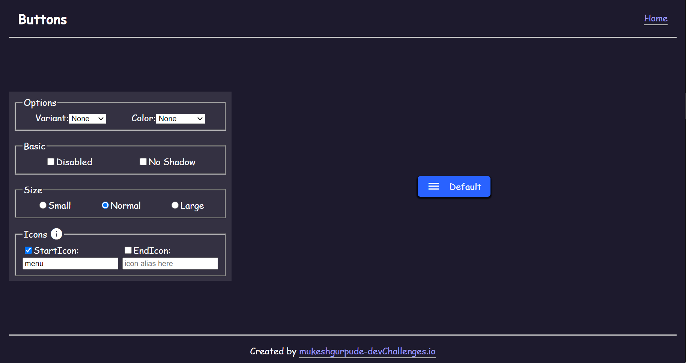

<h1 align="center">Button Component</h1>

<div align="center">
   Solution for a challenge from  <a href="http://devchallenges.io" target="_blank">Devchallenges.io</a>.
</div>

<div align="center">
  <h3>
    <a href="https://button-component-7ca11.web.app/"> Demo </a>
    <span> | </span>
    <a href="https://github.com/mukeshgurpude/button-component"> Solution </a>
    <span> | </span>
    <a href="https://devchallenges.io/challenges/ohgVTyJCbm5OZyTB2gNY"> Challenge </a>
  </h3>
</div>

<!-- TABLE OF CONTENTS -->

## Table of Contents

- [Overview](#overview)
  - [Built With](#built-with)
- [Features](#features)
- [How to use](#how-to-use)
- [Contact](#contact)
- [Acknowledgements](#acknowledgements)

<!-- OVERVIEW -->

## Overview



A reusable button component for React.


### Built With

- [React](https://reactjs.org/)
- [Material UI](https://material-ui.com)
- [React Router DOM](https://reactrouter.com/web)
- Hosted using [firebase](https://firebase.google.com/docs/hosting/quickstart)

## Features

This application/site was created as a submission to a [DevChallenges](https://devchallenges.io/challenges) challenge. The [challenge](https://devchallenges.io/challenges/ohgVTyJCbm5OZyTB2gNY) was to build an application to complete the given user stories.

## How To Use

To clone and run this application, you'll need [Git](https://git-scm.com) and [Node.js](https://nodejs.org/en/download/) (which comes with [npm](http://npmjs.com)) installed on your computer. From your command line:

```bash
# Clone this repository
$ git clone https://github.com/mukeshgurpude/button-component.git

# Install dependencies
$ npm install

# Run the app
$ npm start
```

## Acknowledgements

- [Material UI](https://material-ui.com)
- [Get started with firebase hosting](https://firebase.google.com/docs/hosting/quickstart)
- [Building reusable React components](https://blog.logrocket.com/building-reusable-ui-components-with-react-hooks/)


## Contact

- [LinkedIn](https://linkedin.com/in/mukeshgurpude)
- [GitHub](https://github.com/mukeshgurpude)
- [Twitter](https://twitter.com/mukeshgurpude)
